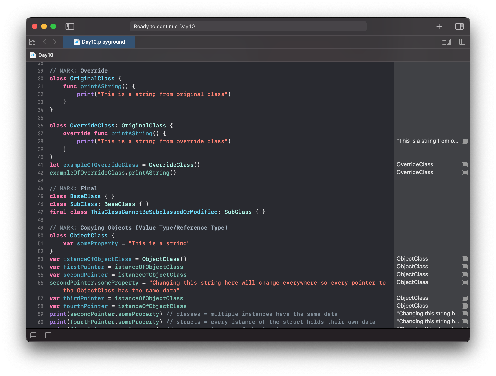
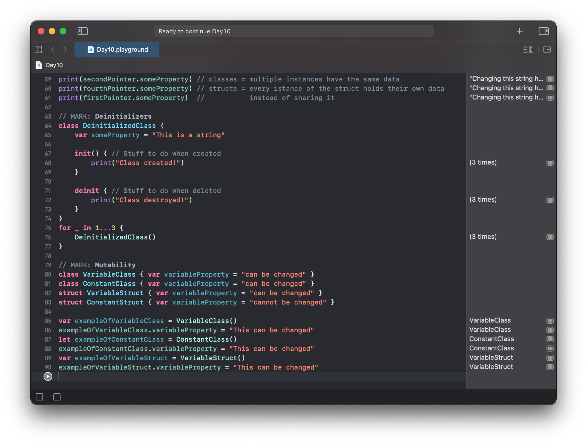

# Day 10

Practiced with Classes:
- Initializers
- Inheritance
- Override Methods
- Final Classes
- Copying Objects
- Deinitializers
- Reference vs Value Type

https://www.hackingwithswift.com/100/swiftui/10