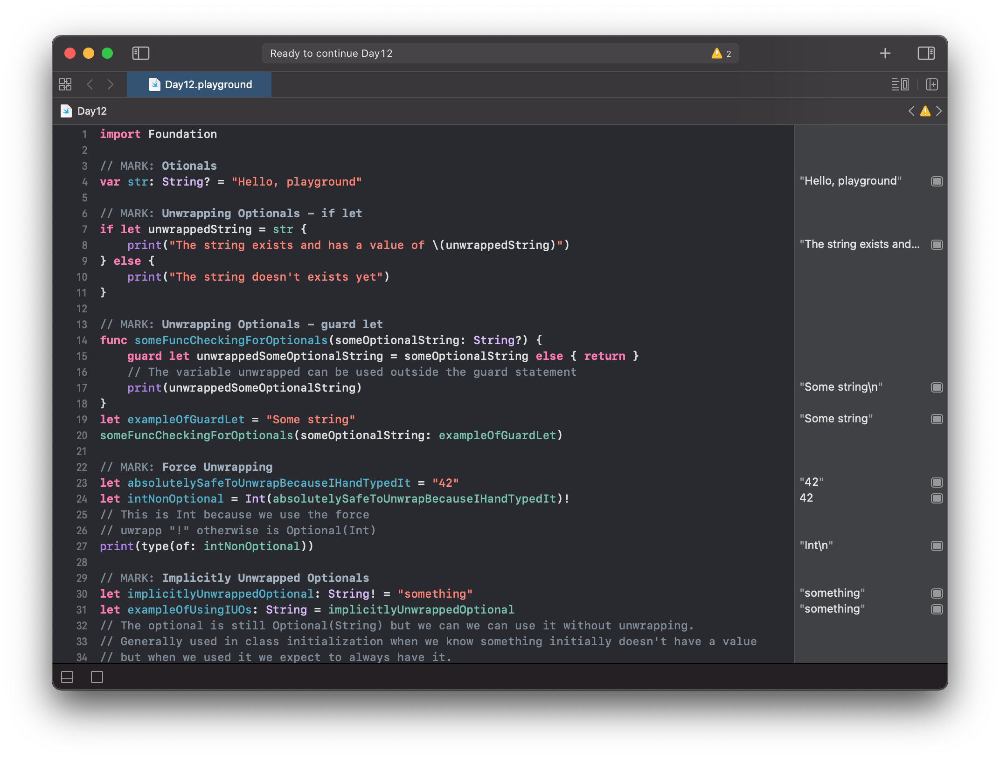
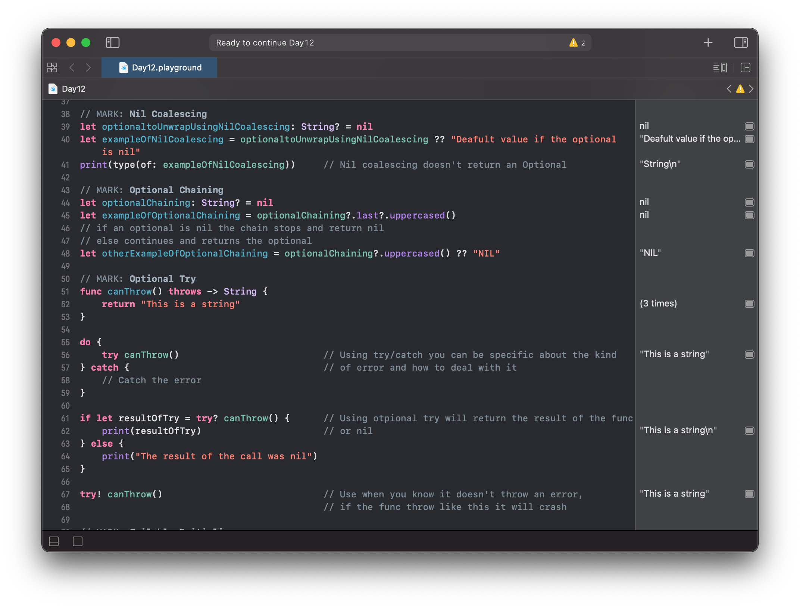
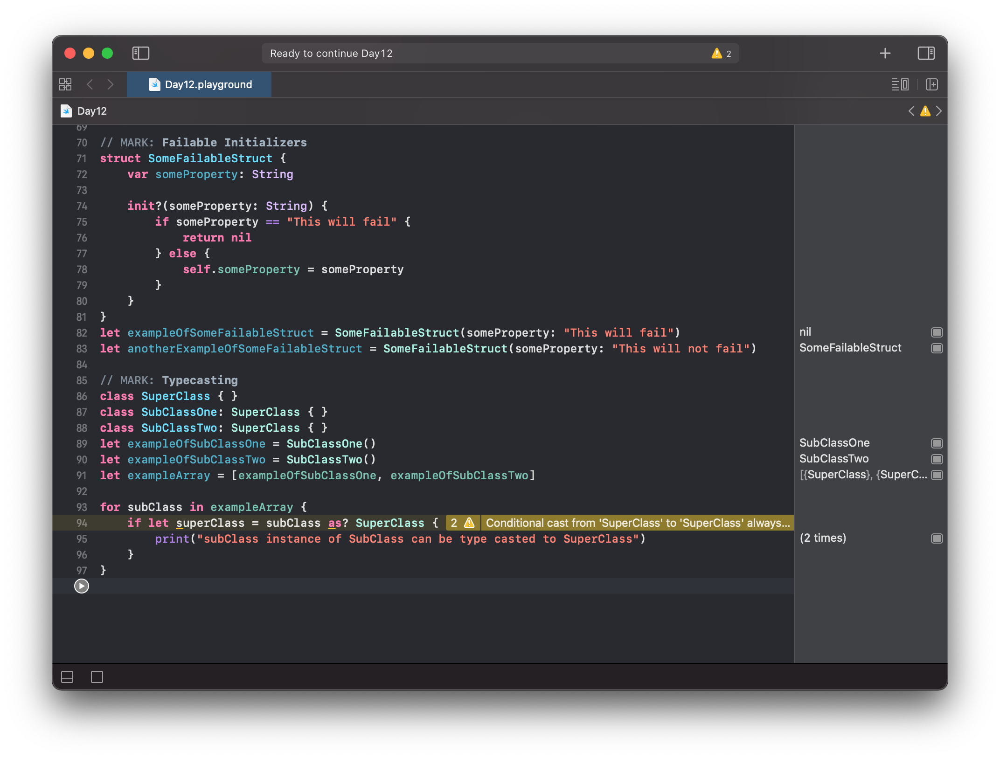

# Day 12

Practiced with Optionals:
- Unwrapping Optionals
- Unwrapping with Guard
- Force Unwrapping
- Implicitly Unwrapped Optionals
- Nil Coalescing
- Optional Chaining
- Optional Try
- Failable Initializer
- Typecasting

https://www.hackingwithswift.com/100/swiftui/12