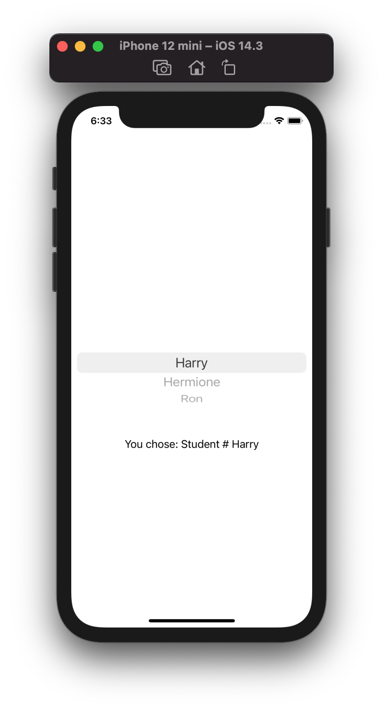

# Day 16

- Swift doesn't allow more than 10 views inside the body var of ContentView so you should Group them in Group or Section.
- NavigationBar can have titles and buttons, and can presents new views when the user interact with it.
- You can change views with Modifiers, they return a new instance of the view attached to.
- @State is a property wrapper that can manage data in SwiftUI.
- Two-way Binding ($) can make read and write a variable
- ForEach can loop over a range and make views without the 10 limit.

https://www.hackingwithswift.com/100/swiftui/16