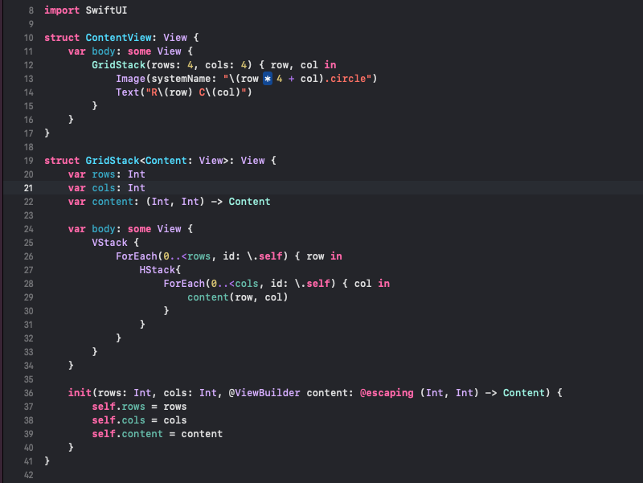

# Day 23

Practiced with Views and Modifiers:
- UIKit uses class inheritance to build UIView (subclassing can make views do different things but is a problem when views inherit useless properties like UIStackView background), SwiftUI uses struct so they're cheap to build (challenge to think about design and views like UI functions that present data, so they're stateless)
- UIHostingController is the bridge between UIKit and SwiftUI for now
- The order of the modifiers of a view matter because everytime we add a modifier we create a new type of that view, so drawing a view takes its modifiers from top to bottom and produces a generic View with some ModifiedContent wrapper around it per modifier
- some View is a feature of Swift called opaque return type and that means we don't know/care exactly what type is returned but we know that this type conforms to this particular View protocol (A generic with a specific caveat)
- You can use ternary operator of if statements to conditionally return a view (be carefull to return the exact specific type of view)
- Environment Modifiers like .font() can be applied to Container views and they change all the child views inside (a child view can override its parent modifiers)
- On complex layout you can make your code easier to read making views as property
- You can create custom views to make a complex layout much easier to read
- You can create custom modifier using ViewModifier and its func body() and make an extension on View making a func() calling .modifier(YourCustomModifier)
- You can create custom Containers like GridStack making it conform to the protocol View

https://www.hackingwithswift.com/100/swiftui/23
