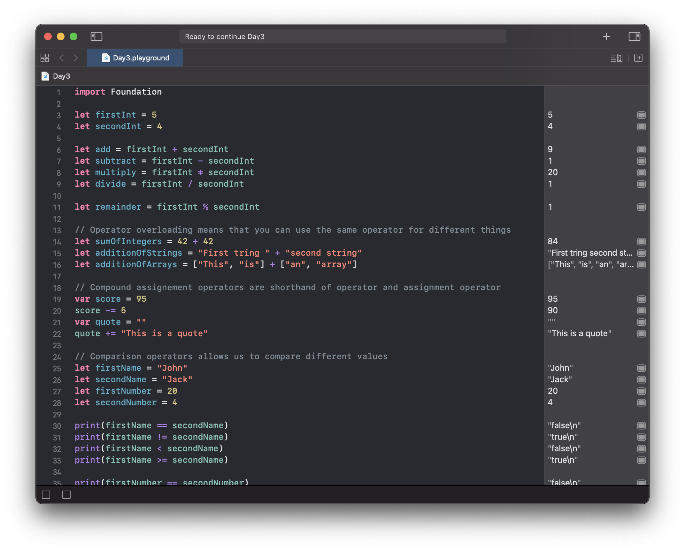
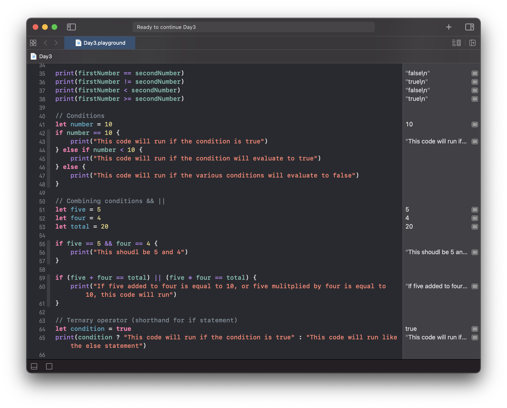
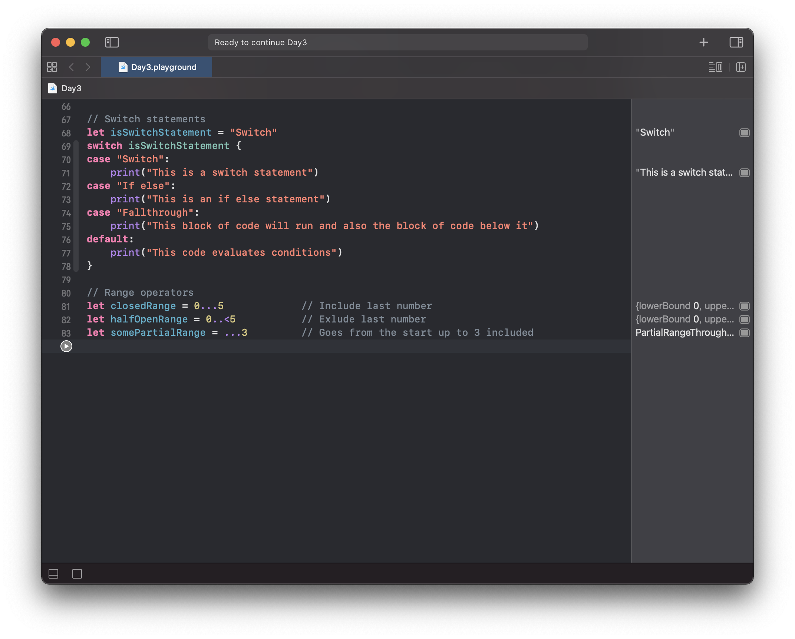

# Day 3

Practiced with operators and conditions:
- Arithmetic operators
- Operator overloading
- Compound assignment operators
- Comparison operators
- Conditions
- Combining conditions
- Ternary operator
- Switch statement
- Range operator

https://www.hackingwithswift.com/100/swiftui/3