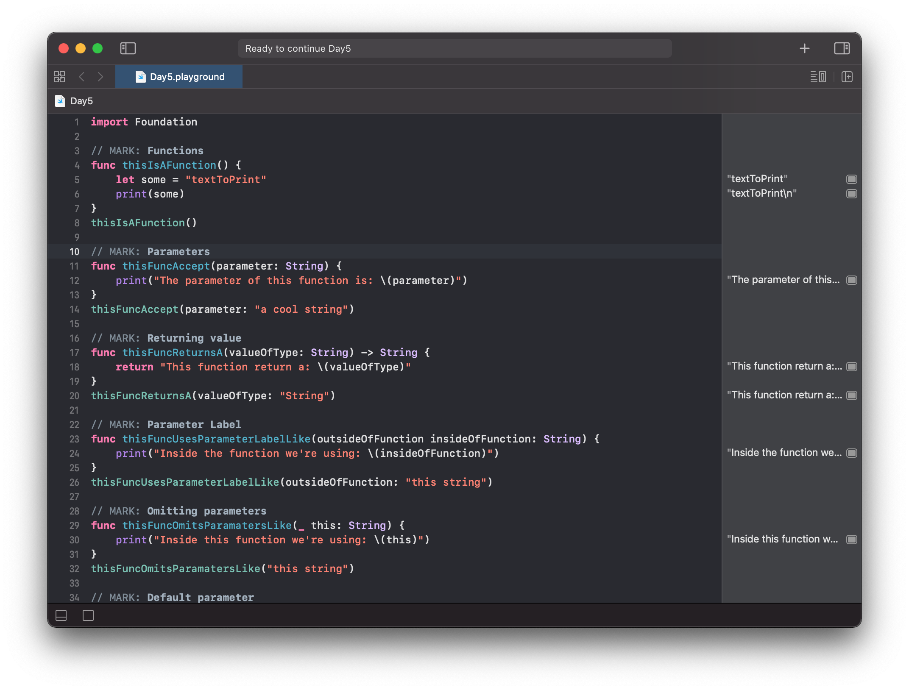
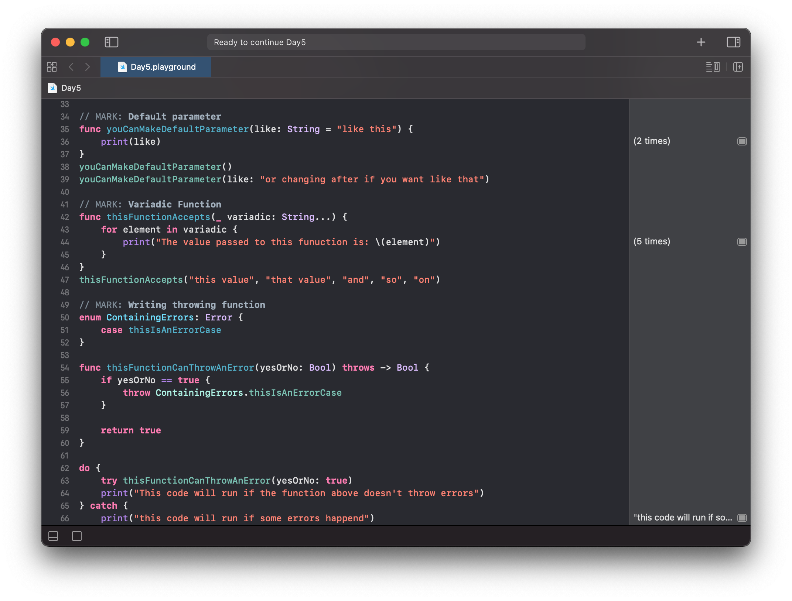
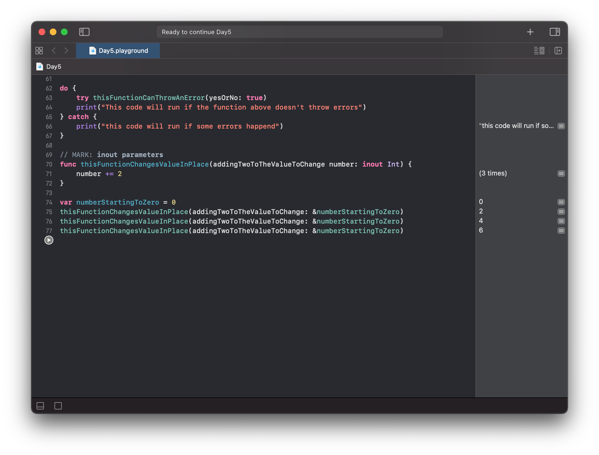

# Day 5

Practiced with loops:
- Functions
- Parameters
- Returning Values
- Parameters Label
- Omitiing Parameters Label
- Default Parameters
- Variadic Functions
- Throwing Functions
- inout Parameters

https://www.hackingwithswift.com/100/swiftui/5