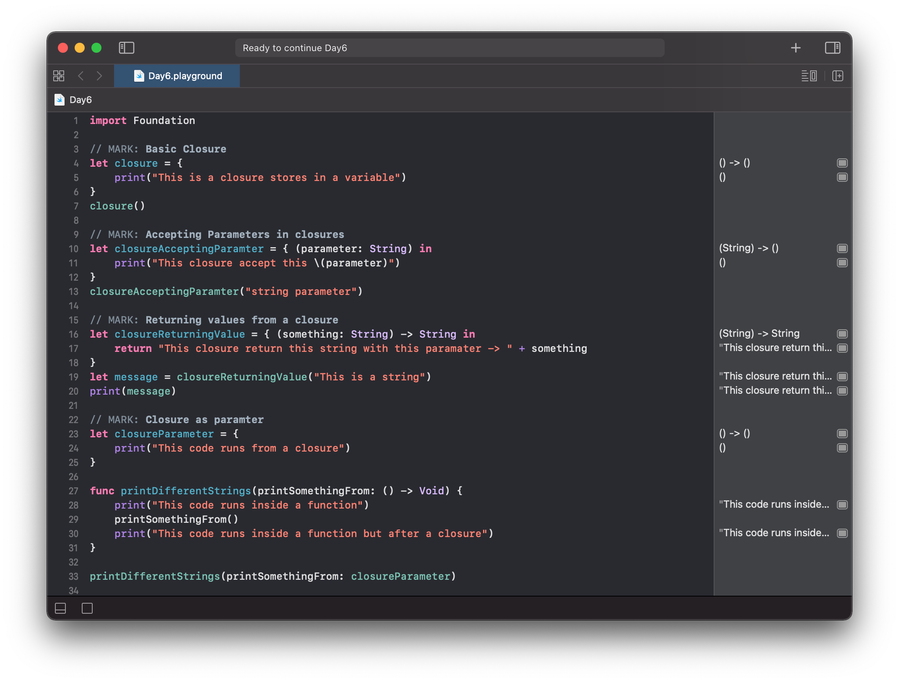
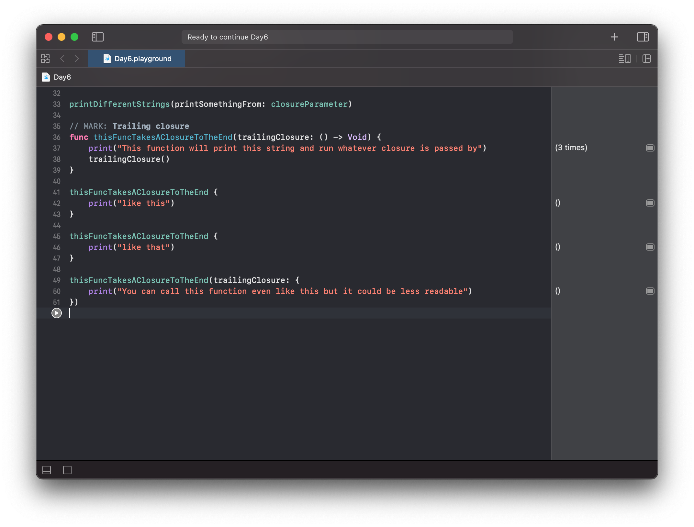

# Day 6

Practiced with closures:
- Bsic Closure
- Accepting Parameter in a Closure
- Returning Values from a Closure
- Closure as Parameters
- Trailing Closure Syntax

https://www.hackingwithswift.com/100/swiftui/6