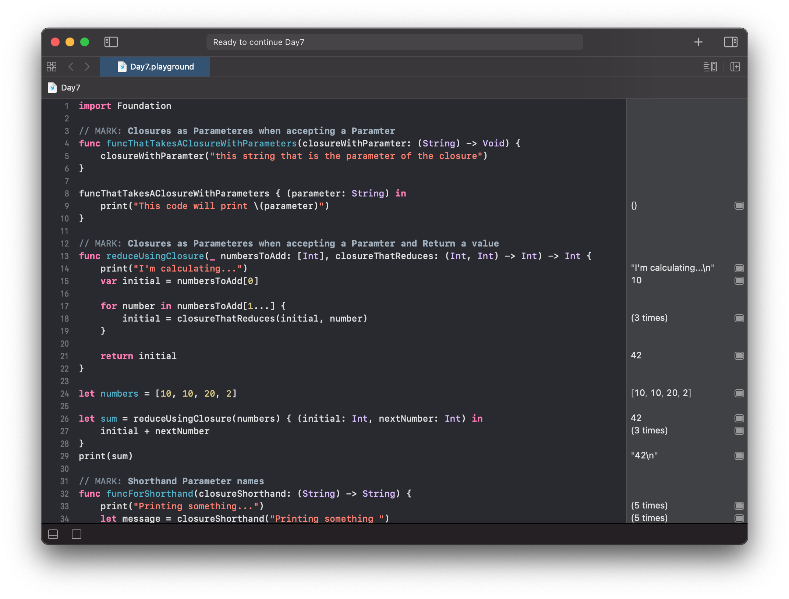
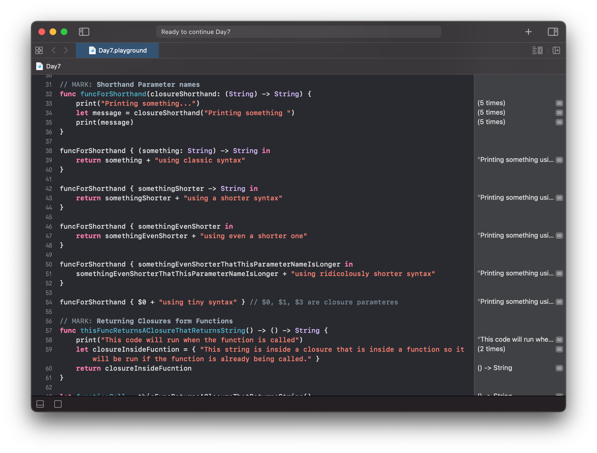
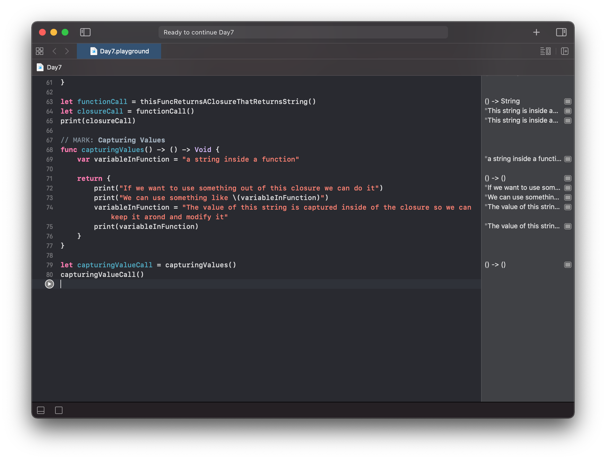

# Day 7

Practiced with closures (part2):
- Using Closures as Parameters When Accepting Paramters
- Using Closures as Parameters When Return Values
- Shorthand Parameter Names
- Returning Closures form Functions
- Capturing Values

https://www.hackingwithswift.com/100/swiftui/7