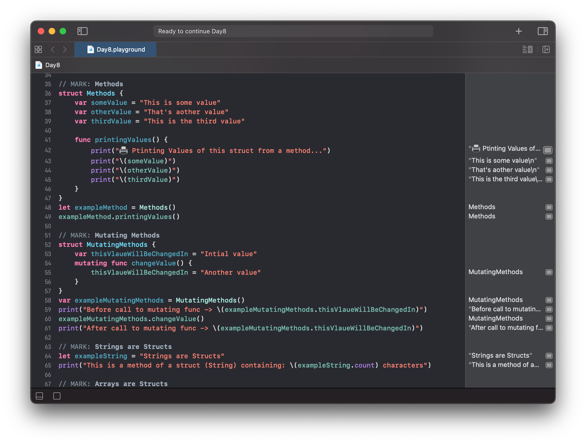
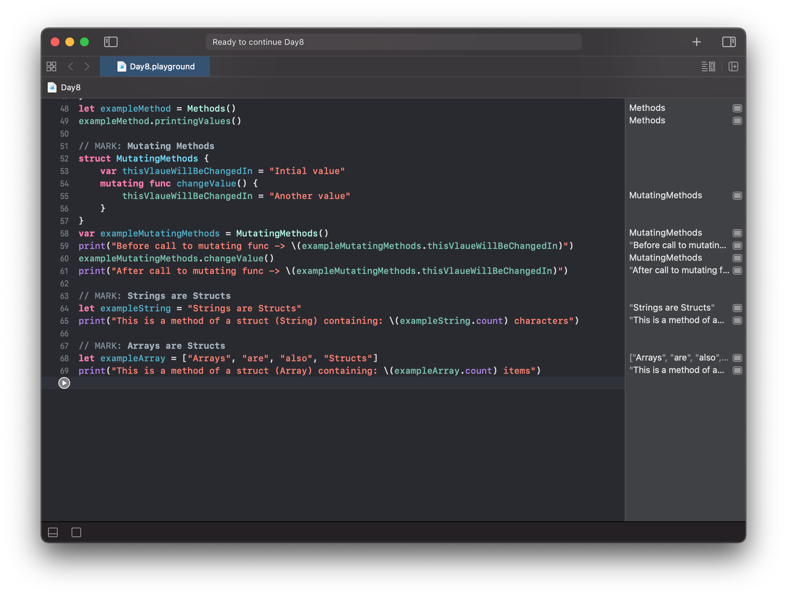

# Day 8

Practiced with Structs:
- Computed Properties
- Property Observers
- Methods
- Properties and Methods of Strings
- Properties and Methods of Arrays

https://www.hackingwithswift.com/100/swiftui/8